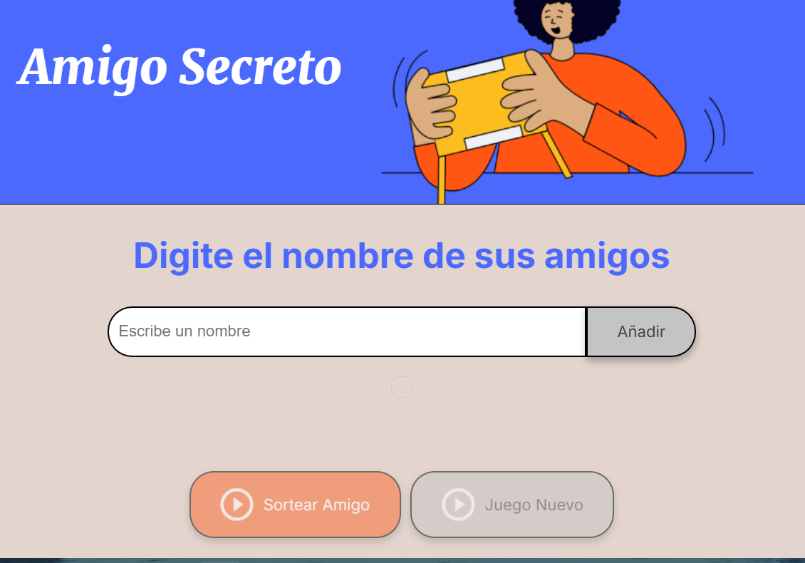
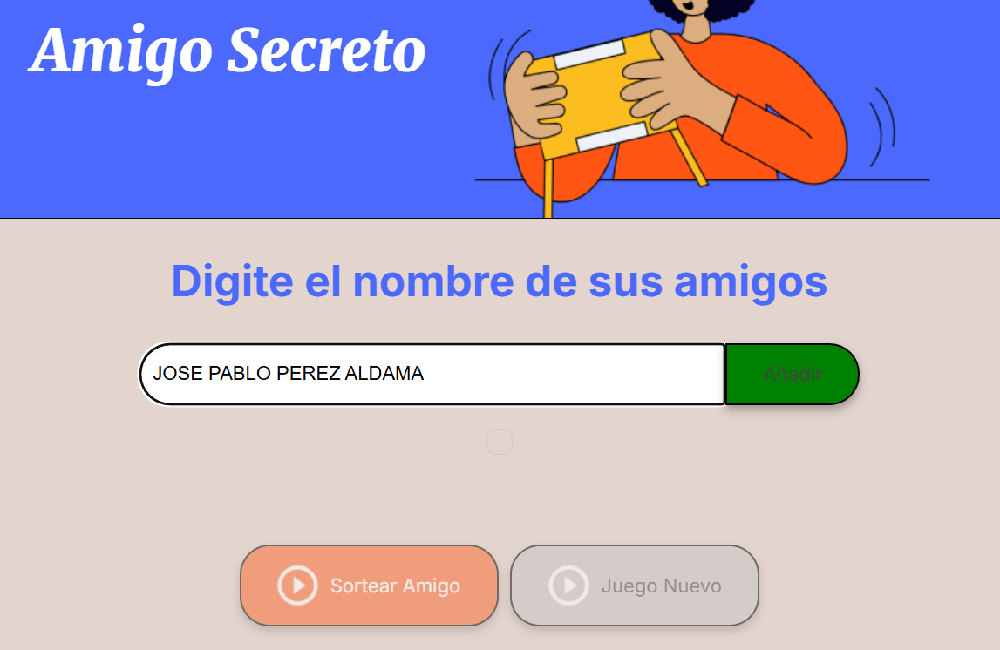
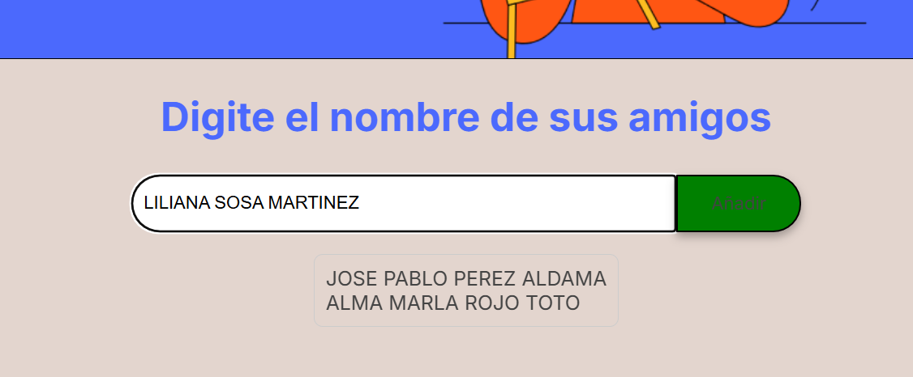
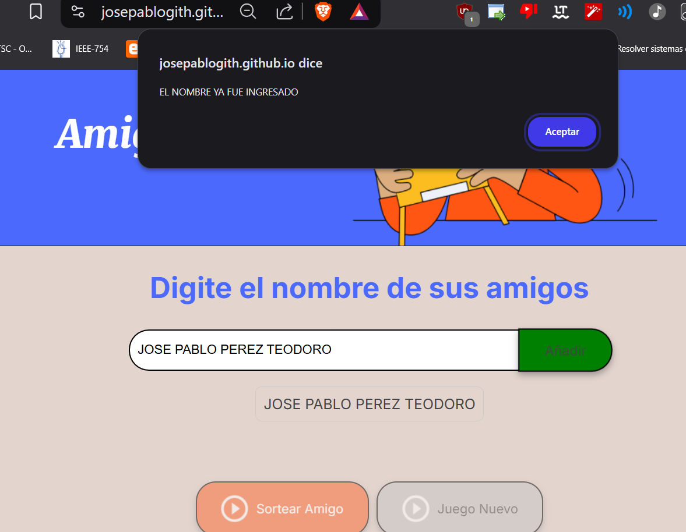
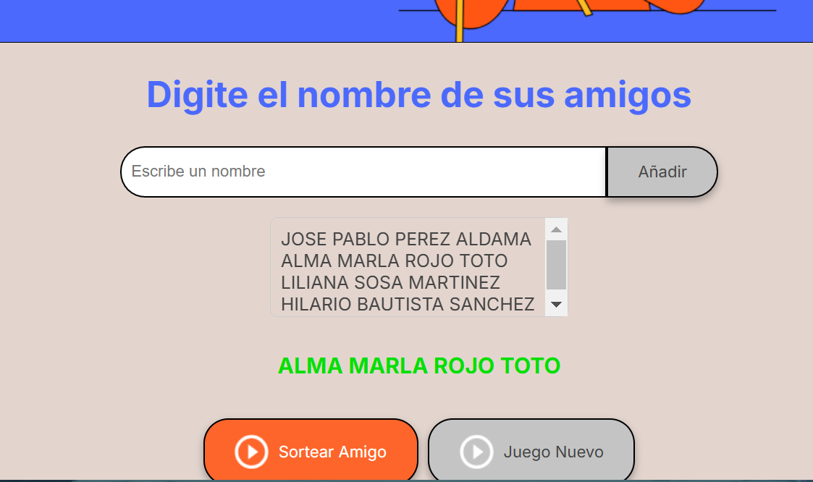
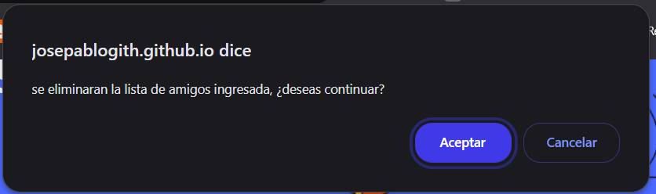

# Amigo Secreto

Este es un proyecto propuesto por el curso ORACLE para realizar sorteos de "Amigo Secreto" de manera sencilla.

## 📌 Características
- Permite agregar nombres de participantes.
- Muestra la lista de nombres ingresados.
- Realiza un sorteo aleatorio para seleccionar un "Amigo Secreto".
- Opción para reiniciar el juego y comenzar desde cero.

## 🚀 Tecnologías Utilizadas
- HTML5
- CSS3
- JavaScript

## 📂 Estructura del Proyecto
   - este proeyecto se formo en base a la prediccion de nombres y apellidos
   - la base de este proyecto esta en el uso de ccv de nombres y apellidos comunes en latinoamerica
## 📜 Instrucciones de Uso
1. Clona el repositorio o descarga los archivos.
   - Este programa esta pensado para que no sea tan facil de romper
   - Apesar de lo anteriormente descrito, es posible meter nombres no adecuados los cuales pueden estar correctos dentro de los ccv
   - la solucion a este problema se implementara en futuras verciones
   - Para hacer funcionar el programa, debes de seguir los siguientes pasos
   - 1.- Debes de ingresar almenos 2 nombres completos diferentes
   - 1.2- en caso de que el nombre sea incorrecto, el boton de agregar amigo cambiara su color a rojo; en caso de que sea correcto se pondra de color verde;
   - 3.- Una vez que existan mas de 2 nombres ingresados, podras seleccionar el boton sortear amigo, el cual de forma interna "JS" se elegira al azar
   -  4.- Si deseas, cambiar el listado de amigos ingresados, solo basta seleccionar nuevo juego.
    git clone <URL_DEL_REPOSITORIO>

    ## Implemetaciones futuras
      - se tiene pensado separar el area de ingreso de nombres y apellidos
      - para incrementar el nivel de prediccion se pondra un area de seleccion de ubicacion, de esta forma se conectaran ccv mas especificados
      - en el area de nuevo juego, se ingresara una opcion para eliminar 1 solo nombre, en caso de que el usuario desee eliminar solo un nombre; para inplementar esto sera necesario agregarle 1d o saber la posicion de cada uno de los elementos ingresados

##  AREA DE FOTOS DEL PROYECTO
   - Funcionamiento del proyecto
     
   - En la pantalla inicial se puede ver el area de ingreso de nombre
   - un boton llamado añadir
   - 2 botones ocultos llamados sortear amigo y juego nuevo, estos se encuentran cerrados al inicio para mantener la logica del juego.
### Pantalla de ingreso
   
   - En esta pantalla se puede ver el funcionamiento de ingreso de nombres, cuando se determina mediante el uso de los ccv un nombre  valido dentro de las  listas el boton de añadir cambiara de color a verde, en caso contrario se colocara de color rojo, impidiendo el ingreso de nombre.
## Lista de nombres ingresada
   
   - Se puede ver claramente la forma en la cual se van a ir colocando los nombres de los amigos ingresados
   
   - se implemento una validacion de nombres similares a ingresar, cabe destacar que este sistema aun tiene un fallo, debido a que no se hizo uso de 2 casillas que se encargaran de manejar el area de ingreso de nombres y otro para el area de ingreso para los apellidos, aun asi se puede observar el como se vera para futuras actuallizacaiones.
## Pantalla de sorteo de amigos
 
 - podemos observar que se puede elegir un mobre de las listas de amigos ingresados, este se mostrara con color verde
 - cabe mencionar que este juego tiene la posibilidad de sortear mas de un amigo sin repetir nombres sorteados, vasta con pulsar el boton sortear amigo nuevamente para comprobarlo.
 - ## Pantalla Juego Nuevo
   
   - cuando pulsamos nuevo juego, se nos notificara por una alerta las posibles concecuencias que pueden suseder una vez que se solicite un nuevo juego.
   ## Pantalla final, el regreso
   
   - cuando pulsemos nuevo juego y aceptemos las concecuencias, los datos se resetearan permitiendo el nuevo conjunto de nombres.
